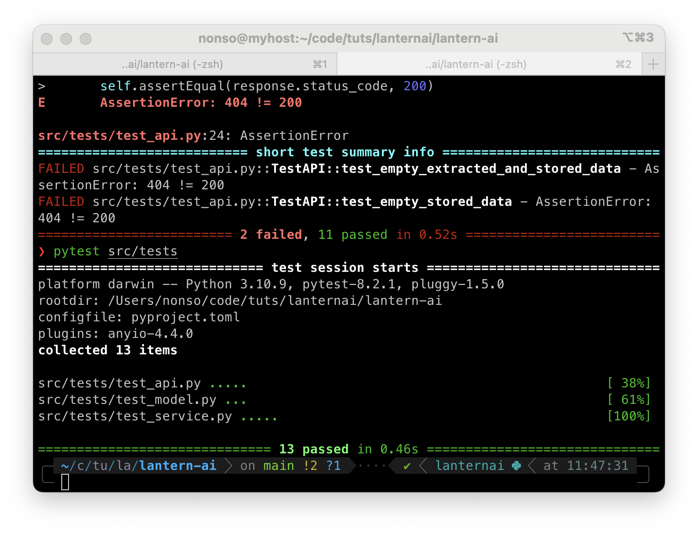
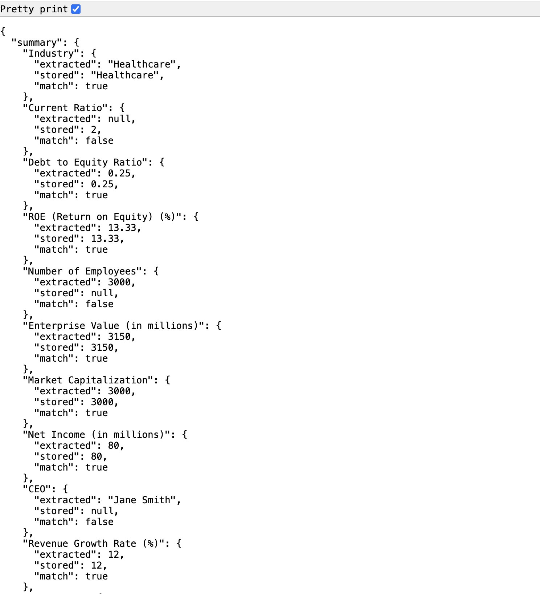

# Notes

Follow Test-driven development approach

Compare all keys from both stored and extracted data

## Following best practice and being SOLID

### API Design Best Practices

RESTful Design Principles: Design the API following REST principles to ensure it's intuitive and easy to use. Use appropriate HTTP methods (GET, POST, etc.) and status codes (200, 400, 404, etc.).

Input Validation and Error Handling: Validate user inputs to prevent incorrect data from being processed. Handle errors gracefully and provide meaningful error messages.

Documentation: Document the API endpoints, their inputs, outputs, and any potential errors. Use tools like Swagger or Redoc to generate interactive API documentation.

### Code Quality and Maintainability

Modular Code Structure: Organize the code into modules and functions with single responsibilities to enhance readability and maintainability.

Type Annotations: Use type annotations to make the code more understandable and to leverage static type checkers like mypy.

Configurable Settings: Externalize configuration settings such as file paths, API keys, and other parameters to a configuration file or environment variables.

### Testing Best Practices

Unit Tests: Write unit tests for individual functions and classes to ensure they work as expected. Use mocking to isolate components and avoid dependencies on external services.

Integration Tests: Write integration tests to ensure that the components work together as expected. Test the API endpoints thoroughly.

Test Coverage: Aim for high test coverage to ensure that most of the code is tested. Use tools like `pytest-cov` to measure test coverage.

Continuous Integration: Use CI/CD pipelines to run tests automatically on every commit or pull request to catch issues early.

### Performance and Scalability

Caching: Implement caching for expensive operations, such as reading and parsing large files, to improve performance.

Concurrency: If applicable, use asynchronous programming to handle multiple requests concurrently and improve scalability.

Security Best Practices
Authentication and Authorization: Secure the API endpoints using authentication and authorization mechanisms to ensure that only authorized users can access the API.

Data Sanitization: Sanitize inputs to prevent security vulnerabilities such as SQL injection and cross-site scripting (XSS).

# Data discrepancy checker

This task mirrors a system we recently built internally, and will give you an
idea of the problems we need to solve.

Every quarter, new company data is provided to us in PDF format. We need to use
an external service to extract this data from the PDF, and then validate it
against data we have on file from another source.

Complete the API so that:

A user can provide a PDF and a company name data is extracted from the PDF via
the external service and compared to the data stored on file a summary of the
data is returned, containing all fields from both sources, noting which fields
did not match.

A selection of example PDFs have been uploaded, and the PDF
extraction service has been mocked for use in `src/pdf_service.py` - DO NOT
EDIT THIS FILE. There is simple documentation of the service in
`PDF_SERVICE_DOCS.md`. You can treat this as just another microservice.

The existing data we have on file is available in the `data/database.csv` file.

Treat this code as if it will be deployed to production, following best
practices where possible.

## Setup using Poetry

The easiest way to set up the repository is to use `python-poetry`. The lock file
was generated using version `1.8.3`

1. Ensure `poetry` is installed
2. Run `make install`

## Setup without Poetry

Alternatively it's possible to `pip install` directly using the
`pyproject.toml` or `requirements.txt`.
